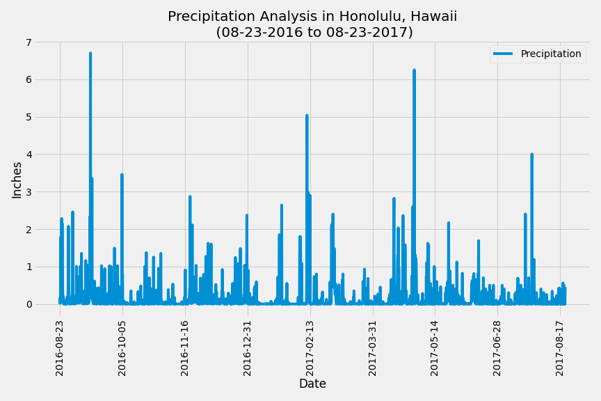
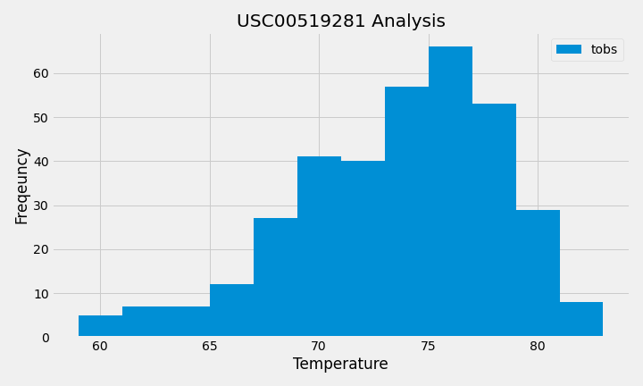

# sqlalchemy-challenge

## Overview 

Welcome to Honolulu, Hawaii! This project analyzes the climate data of Honolulu using SQLAlchemy ORM queries, Pandas, and Matplotlib. Jupyter notebook and Visual Studio Code were utilized to successfully execute the code. 

## Analysis

Python and SQLAlchemy were used to analyze climate data and explore the data of the Hawaii climate database. The last 12 months of precipitation data were queried and plotted into a bar plot that can be seen in the results section below. This graph allows the viewer to visualize trends in precipitation measured in inches. There is an obvious increase in precipitation between August to October of 2016, January to March of 2017, and April to May of 2017. The nine stations where the data was collected were also analyzed to determine which station had the most temperature observations. The data was then used create a histogram that can be seen below in the results section. There are visibly more temperature observations when the weather is between 75 and 80 degrees Farenheight as depicted in the histogram. 

## Results
### Precipitation Analysis

### Station Analysis

